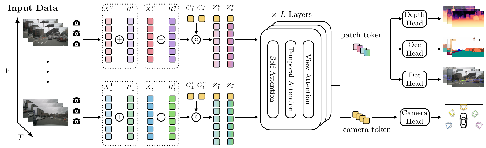

<div align="center">

<h1>Geometry-Grounded Unified 3D Perception<br>for Autonomous Driving</h1>

<div>
    Longfei Xu<sup>1,*</sup>&emsp;
    Xiaohui Wang<sup>2,*</sup>&emsp;
    Zehao Huang&emsp;
    Han Li<sup>1</sup>&emsp;
    <br>
    Ya Yang<sup>2</sup>&emsp;
    Naiyan Wang&emsp;
    Si Liu<sup>1,&dagger;</sup>
</div>
<div>
    <sup>1</sup>Beihang University&emsp;
    <sup>2</sup>Beijing University of Posts and Telecommunications
</div>
<div>
    <sup>*</sup>Equal contribution&emsp;
    <sup>&dagger;</sup>Corresponding author
</div>

<div>
    <h4 align="center">
        <a href="https://arxiv.org/abs/2608.13147" target="_blank">
            
        </a>
        <a href="https://buaa-colalab.github.io/geoup_page" target="_blank">
            
        </a>
        <a href="https://huggingface.co/s1lencexw/GeoUP/tree/main" target="_blank">
            
        </a>
        <a href="#-citation">
            
        </a>
    </h4>
</div>

<strong>GeoUP adapts the reconstruction-oriented latent of VGGT to calibrated, streaming multi-camera driving scenes and uses one geometry-grounded representation for metric depth estimation, 3D object detection, and semantic occupancy prediction.</strong>

<div style="text-align:center">

</div>

---

</div>

## 📢 News

- **[2026-07-31]** The GeoUP paper, code, and model weights are released.

## 💡 Highlights

- **Geometry-grounded backbone.** GeoUP builds on VGGT-12, injects patch-aligned Pl&uuml;cker ray embeddings and camera tokens, and factorizes cross-image interaction into self, temporal, and view attention. This grounds the shared latent in camera calibration, metric scale, and scene geometry while separately modeling within-image context, same-camera history, and synchronized cross-camera correspondence.
- **Unified 3D perception.** Task-specific readout heads decode surface-, instance-, and volume-level predictions as metric depth, 3D boxes, and semantic occupancy. Camera pose prediction provides auxiliary geometric supervision.
- **Multi-task, multi-dataset learning.** GeoUP jointly learns from nuScenes, Argoverse 2, Waymo, KITTI, and DDAD while respecting their different camera layouts, perception ranges, label spaces, and available annotations.

## 📊 Main Results

`GeoUP` denotes single-dataset training. `GeoUP`<sup>&dagger;</sup> denotes joint training on nuScenes, Argoverse 2, Waymo, KITTI, and DDAD, with each sample supervising only the heads for which annotations are available. Only the strongest prior result is retained for each comparison; bold values are the best among the displayed methods.

### 3D Object Detection

#### nuScenes Validation

| Method | Backbone | Input size | mAP &uarr; | NDS &uarr; | mATE &darr; | mASE &darr; | mAOE &darr; | mAVE &darr; | mAAE &darr; |
| :--- | :---: | :---: | ---: | ---: | ---: | ---: | ---: | ---: | ---: |
| RayDN | EVA02 | 800 &times; 320 | 54.1 | 62.4 | 0.518 | **0.252** | 0.274 | 0.230 | **0.195** |
| **GeoUP (Ours)** | ViT-L | 800 &times; 320 | 57.9 | 64.4 | 0.516 | 0.259 | **0.254** | 0.223 | 0.204 |
| **GeoUP<sup>&dagger;</sup> (Ours)** | ViT-L | 800 &times; 320 | **59.2** | **65.3** | **0.496** | 0.254 | 0.271 | **0.217** | 0.196 |

#### Argoverse 2 Validation

| Method | Backbone | Input size | mAP &uarr; | CDS &uarr; | mATE &darr; | mASE &darr; | mAOE &darr; |
| :--- | :---: | :---: | ---: | ---: | ---: | ---: | ---: |
| Far3D | ViT-L | 1536 &times; 1536 | 31.6 | 23.9 | 0.732 | **0.303** | 0.459 |
| **GeoUP (Ours)** | ViT-L | 960 &times; 640 | 37.2 | 28.2 | 0.735 | 0.315 | 0.461 |
| **GeoUP<sup>&dagger;</sup> (Ours)** | ViT-L | 960 &times; 640 | **43.6** | **33.8** | **0.668** | 0.304 | **0.428** |

#### Waymo Validation

| Method | Backbone | Input size | mAPL &uarr; | mAP &uarr; | mAPH &uarr; |
| :--- | :---: | :---: | ---: | ---: | ---: |
| DenseBEV++ | R101-DCN | 1920 &times; 1280 | 42.4 | 60.2 | 56.4 |
| **GeoUP (Ours)** | ViT-L | 960 &times; 640 | 51.5 | 67.0 | 63.5 |
| **GeoUP<sup>&dagger;</sup> (Ours)** | ViT-L | 960 &times; 640 | **54.3** | **70.7** | **67.7** |

### Semantic Occupancy Prediction

| Method | Backbone | Input size | mIoU &uarr; | RayIoU &uarr; | RayIoU<sub>1m</sub> &uarr; | RayIoU<sub>2m</sub> &uarr; | RayIoU<sub>4m</sub> &uarr; |
| :--- | :---: | :---: | ---: | ---: | ---: | ---: | ---: |
| OPUS-V2-L<sup>&Dagger;</sup> (8f) | ViT-L | 704 &times; 256 | 39.9 | 45.2 | 39.0 | 46.3 | 50.4 |
| **GeoUP (Ours, 8f)** | ViT-L | 704 &times; 256 | 41.5 | 45.9 | 39.3 | 47.1 | 51.3 |
| **GeoUP<sup>&dagger;</sup> (Ours, 8f)** | ViT-L | 704 &times; 256 | **42.3** | **47.0** | **40.7** | **48.1** | **52.2** |

<sup>&Dagger;</sup> denotes our reproduced OPUS-V2-L variant trained with a ViT-L backbone using the official OPUS-V2 codebase.

### Metric Depth Estimation

<table>
  <thead>
    <tr>
      <th rowspan="2">Method</th>
      <th colspan="2">KITTI</th>
      <th colspan="2">DDAD</th>
    </tr>
    <tr>
      <th>Abs Rel &darr;</th>
      <th>&delta; &lt; 1.25 &uarr;</th>
      <th>Abs Rel &darr;</th>
      <th>&delta; &lt; 1.25 &uarr;</th>
    </tr>
  </thead>
  <tbody>
    <tr>
      <td>Best prior<sup>*</sup></td>
      <td>0.102</td>
      <td>90.3</td>
      <td>0.185</td>
      <td>77.1</td>
    </tr>
    <tr>
      <td><strong>GeoUP (Ours)</strong></td>
      <td><strong>0.072</strong></td>
      <td><strong>93.8</strong></td>
      <td><strong>0.114</strong></td>
      <td><strong>89.5</strong></td>
    </tr>
    <tr>
      <td><strong>GeoUP<sup>&dagger;</sup> (Ours)</strong></td>
      <td>0.075</td>
      <td>92.9</td>
      <td>0.123</td>
      <td>87.6</td>
    </tr>
  </tbody>
</table>

<sup>*</sup> Best prior denotes StreamVGGT on KITTI and MapAnything on DDAD.

### End-to-End Planning

| Visual backbone | EPDMS, original evaluator &uarr; | EPDMS, corrected evaluator &uarr; |
| :--- | ---: | ---: |
| DA-ViT-L | 87.1 | 90.5 |
| **GeoUP (Ours)** | **87.9** | **91.4** |

All planning variants use the same DriveSuprim decoder and training configuration, differing only in the visual backbone. See the [paper](https://arxiv.org/abs/2608.13147) for complete comparisons, ablations, efficiency analysis, and qualitative results.

## 🛠️ Usage

### Installation

The maintained environment uses Python 3.9, CUDA 11.8, PyTorch 2.7.1, torchvision 0.22.1, MMDetection3D 1.0.0rc6, and Flash Attention 2.7.1.post4 when enabled.

```bash
conda create -n geoup python=3.9 -y
conda activate geoup

pip install torch==2.7.1 torchvision==0.22.1 torchaudio==2.7.1 \
    --index-url https://download.pytorch.org/whl/cu118
pip install flash-attn==2.7.1.post4 --no-build-isolation

MMCV_WITH_OPS=1 pip install mmcv-full==1.7.2
pip install mmdet==2.28.2 mmsegmentation==0.30.0 mmdet3d==1.0.0rc6

git clone https://github.com/open-mmlab/mmdetection3d.git
git -C mmdetection3d checkout v1.0.0rc6

python -m pip install "networkx==2.4" IPython av2==0.2.1 refile \
    einops psutil torch_scatter fvcore spconv-cu118 numpy==1.22.4

pushd projects/mmdet3d_plugin/models/utils/csrc
python setup.py build_ext --inplace
popd
```

MMCV 1.7.2 requires three compatibility changes with this PyTorch version. Apply them automatically after installing MMCV and MMDetection3D:

```bash
python - <<'PY'
from importlib.metadata import distribution
from pathlib import Path


def replace_once(path, old, new):
    path = Path(path)
    content = path.read_text()
    if new in content:
        print(f'Already patched: {path}')
        return
    if content.count(old) != 1:
        raise RuntimeError(f'Expected source was not found exactly once: {path}')
    path.write_text(content.replace(old, new))
    print(f'Patched: {path}')


mmcv_dir = Path(distribution('mmcv-full').locate_file('mmcv')).resolve()
mmdet3d_init = Path(
    distribution('mmdet3d').locate_file('mmdet3d/__init__.py')
).resolve()

replace_once(
    mmdet3d_init,
    "mmcv_maximum_version = '1.7.0'",
    "mmcv_maximum_version = '1.7.2'",
)
replace_once(
    mmcv_dir / 'parallel/_functions.py',
    '            streams = [_get_stream(device) for device in target_gpus]',
    '''            from packaging import version
            if version.parse(torch.__version__) >= version.parse('2.1.0'):
                streams = [
                    _get_stream(torch.device('cuda', device))
                    for device in target_gpus
                ]
            else:
                streams = [_get_stream(device) for device in target_gpus]''',
)
replace_once(
    mmcv_dir / 'parallel/distributed.py',
    '''        module_to_run = self._replicated_tensor_module if \\
            self._use_replicated_tensor_module else self.module''',
    '''        module_to_run = self._replicated_tensor_module if \\
            hasattr(self, "_use_replicated_tensor_module") and \\
            self._use_replicated_tensor_module else self.module''',
)
PY
```

### Data Preparation

#### nuScenes

Download the nuScenes full dataset from the [official website](https://www.nuscenes.org/download) and extract the trainval release to:

```text
data/nuscenes/
├── maps/
├── samples/
├── sweeps/
└── v1.0-trainval/
```

Generate the 2D annotations and temporal metadata used by GeoUP:

```bash
python tools/create_data_nusc.py \
    --root-path data/nuscenes \
    --extra-tag nuscenes2d \
    --version v1.0
```

The command writes the following files under `data/nuscenes/`:

```text
nuscenes2d_temporal_infos_train.pkl
nuscenes2d_temporal_infos_val.pkl
nuscenes2d_temporal_infos_test.pkl
```

The test info file requires the nuScenes test release; training and validation only require the first two files. Compatible upstream StreamPETR info files are also available for [train](https://github.com/exiawsh/storage/releases/download/v1.0/nuscenes2d_temporal_infos_train.pkl), [validation](https://github.com/exiawsh/storage/releases/download/v1.0/nuscenes2d_temporal_infos_val.pkl), and [test](https://github.com/exiawsh/storage/releases/download/v1.0/nuscenes2d_temporal_infos_test.pkl).

#### Occ3D-nuScenes

Download Occ3D-nuScenes from the [Occ3D project page](https://tsinghua-mars-lab.github.io/Occ3D/) and place the contents of its `gts/` directory directly under `data/nuscenes/occ_gts/`. Do not retain an additional `gts/` level:

```text
data/nuscenes/occ_gts/
└── scene-xxxx/
    └── <sample-token>/
        └── labels.npz
```

#### nuScenes Depth Supervision

GeoUP expects one sparse LiDAR-projected depth map for every camera image. For example:

```text
data/nuscenes/samples/CAM_FRONT/<sample>.jpg
data/nuscenes_depth/samples/CAM_FRONT/<sample>.png
```

Generate these maps for all six cameras with:

```bash
python tools/process_depth/nuscenes_depth.py \
    --data-root data/nuscenes \
    --output-dir data/nuscenes_depth \
    --version v1.0-trainval \
    --num-workers 16
```

Existing maps are skipped, so generation can be resumed. Use `--overwrite` to regenerate files or `--num-sweeps` to aggregate additional LiDAR sweeps. Each output is a 16-bit PNG whose `uint16` payload stores the raw bit pattern of a `float16` depth map in metres.

### Model Preparation

The released checkpoints are hosted in the [GeoUP Hugging Face repository](https://huggingface.co/s1lencexw/GeoUP/tree/main). Stage 1 checkpoints initialize the geometry backbone, depth head, and camera head for training; Stage 2 checkpoints are the final models used for evaluation.

| Stage | Checkpoint | Usage |
| :---: | :--- | :--- |
| 1 | [low_resolution.pth](https://huggingface.co/s1lencexw/GeoUP/blob/main/stage-1/low_resolution.pth) | Initialization for low-resolution inputs |
| 1 | [high_resolution.pth](https://huggingface.co/s1lencexw/GeoUP/blob/main/stage-1/high_resolution.pth) | Initialization for high-resolution inputs |
| 2 | [nuscenes.pth](https://huggingface.co/s1lencexw/GeoUP/blob/main/stage-2/nuscenes.pth) | Evaluate the nuScenes detection, occupancy, and depth model |
| 2 | [multi-datasets.pth](https://huggingface.co/s1lencexw/GeoUP/blob/main/stage-2/multi-datasets.pth) | Evaluate the jointly trained multi-dataset model |

Install the Hugging Face CLI and download all released weights:

```bash
python -m pip install -U huggingface_hub
hf download s1lencexw/GeoUP --local-dir ckpts/GeoUP
```

To download only the weights required for the nuScenes recipe:

```bash
hf download s1lencexw/GeoUP \
    stage-1/low_resolution.pth \
    stage-2/nuscenes.pth \
    --local-dir ckpts/GeoUP
```

### Maintained Configs

| Recipe | Configuration | Stage 1 initialization | Stage 2 model |
| :--- | :--- | :---: | :---: |
| nuScenes depth + detection + occupancy, 24 epochs | [streampetr_opus_..._view_attn.py](projects/configs/GeoUP/streampetr_opus_3dppe_raydn_vggt_tune_raymap_d12_flash_bf16_672_seq_24e_16x1_womv_occseq8_seq4_view_attn.py) | `low_resolution.pth` | `nuscenes.pth` |
| Five-dataset joint training, 50 epochs | [streampetr_3dppe_..._multi_dataset_seq4.py](projects/configs/GeoUP/streampetr_3dppe_raydn_vggt_raymap_d12_flash_bf16_960_seq_50e_64x1_womv_dep1_multi_dataset_seq4.py) | `high_resolution.pth` | `multi-datasets.pth` |

The paper reports benchmark-specific resolutions and training settings. The table above lists the two consolidated recipes retained in this code release.

### Training

Train the nuScenes multi-task model on 16 GPUs:

```bash
NUS_CONFIG=projects/configs/GeoUP/streampetr_opus_3dppe_raydn_vggt_tune_raymap_d12_flash_bf16_672_seq_24e_16x1_womv_occseq8_seq4_view_attn.py

tools/dist_train.sh "$NUS_CONFIG" 16 \
    --work-dir work_dirs/geoup_nuscenes
```

Train the joint model on 64 GPUs:

```bash
JOINT_CONFIG=projects/configs/GeoUP/streampetr_3dppe_raydn_vggt_raymap_d12_flash_bf16_960_seq_50e_64x1_womv_dep1_multi_dataset_seq4.py

tools/dist_train.sh "$JOINT_CONFIG" 64 \
    --work-dir work_dirs/geoup_joint
```

The epoch length and effective batch size are derived from `num_gpus` and `batch_size` inside each config. Update those values together with the learning rate when changing the distributed setup.

### Evaluation

Evaluate all nuScenes tasks:

```bash
NUS_CONFIG=projects/configs/GeoUP/streampetr_opus_3dppe_raydn_vggt_tune_raymap_d12_flash_bf16_672_seq_24e_16x1_womv_occseq8_seq4_view_attn.py
NUS_CHECKPOINT=ckpts/GeoUP/stage-2/nuscenes.pth

tools/dist_test.sh "$NUS_CONFIG" \
    "$NUS_CHECKPOINT" 8 \
    --eval bbox depth occ camera
```

Generate formatted detection results for submission:

```bash
tools/dist_test.sh "$NUS_CONFIG" \
    "$NUS_CHECKPOINT" 8 \
    --format-only
```

### Benchmark

The benchmark includes data loading, model forward, and post-processing latency. Because data loading is included, `workers_per_gpu` affects the result.

```bash
NUS_CONFIG=projects/configs/GeoUP/streampetr_opus_3dppe_raydn_vggt_tune_raymap_d12_flash_bf16_672_seq_24e_16x1_womv_occseq8_seq4_view_attn.py

python tools/benchmark.py "$NUS_CONFIG"
```

### Visualization

#### Forward Outputs

First run distributed inference and save the model outputs. The dump contains detection boxes, depth and confidence, occupancy, camera pose, metadata, and raw image paths. Add `--embed-images` when the dump must be self-contained.

```bash
NUS_CONFIG=projects/configs/GeoUP/streampetr_opus_3dppe_raydn_vggt_tune_raymap_d12_flash_bf16_672_seq_24e_16x1_womv_occseq8_seq4_view_attn.py
NUS_CHECKPOINT=ckpts/GeoUP/stage-2/nuscenes.pth

tools/dist_dump_forward_vis_data.sh \
    "$NUS_CONFIG" "$NUS_CHECKPOINT" 8 \
    --out work_dirs/geoup_forward_vis/forward_dump.pkl \
    --max-samples 50 \
    --score-thr 0.25
```

Render depth, detection, occupancy, pose, and combined panels:

```bash
python tools/vis_forward_dump.py \
    work_dirs/geoup_forward_vis/forward_dump.pkl \
    --out-dir work_dirs/geoup_forward_vis/rendered \
    --score-thr 0.25 \
    --depth-renderer pointcloud \
    --depth-fuse-frames 4 \
    --occ-renderer bev
```

`--occ-renderer bev` works without Mayavi. For higher-quality 3D occupancy rendering, install Mayavi/VTK and use `--occ-renderer mayavi`; on a headless Linux server, run with `QT_QPA_PLATFORM=offscreen` and `xvfb-run`. Useful selection options include `--indices 3 4 5`, `--start`, `--max-samples`, and `--best-k 20 --best-by det_top5_mean`.

#### nuScenes Result Comparison

Compare two formatted nuScenes detection result files and rank samples where GeoUP has a large sample-level F1 advantage:

```bash
python tools/compare_nus_results_visualize.py \
    --ours path/to/geoup/results_nusc.json \
    --other path/to/baseline/results_nusc.json \
    --dataroot data/nuscenes \
    --version v1.0-trainval \
    --out-dir work_dirs/geoup_vs_baseline \
    --ours-name GeoUP \
    --other-name baseline \
    --score-thr 0.25 \
    --top-k 30
```

The output directory contains `selected_samples.csv`, sample-token lists, and `GT | GeoUP | baseline` comparison panels. Use `--no-vis` to generate only the ranking files. The defaults require at least three GeoUP true positives, GeoUP F1 of `0.55`, and an F1 gap of `0.20`; relax them with `--min-ours-tp`, `--min-ours-f1`, and `--min-f1-gap` when too few samples are selected. This sample-level matcher is intended for qualitative selection and does not replace official nuScenes mAP/NDS evaluation.

## 📝 Citation

If you find GeoUP useful in your research, please cite:

```bibtex
@article{xu2026geometry,
  title={Geometry-Grounded Unified 3D Perception for Autonomous Driving},
  author={Xu, Longfei and Wang, Xiaohui and Huang, Zehao and Li, Han and Yang, Ya and Wang, Naiyan and Liu, Si},
  journal={arXiv preprint arXiv:2608.13147},
  year={2026}
}
```

## 📄 License

This project is released under the [Apache License 2.0](LICENSE).

## 🙏 Acknowledgements

GeoUP is built on [StreamPETR](https://github.com/exiawsh/StreamPETR) and [MMDetection3D](https://github.com/open-mmlab/mmdetection3d), and adapts the geometry representation introduced by [VGGT](https://github.com/facebookresearch/vggt). We also thank the authors of [DINOv2](https://github.com/facebookresearch/dinov2), [RayDN](https://github.com/LiewFeng/RayDN), [OPUS/OPUS-V2](https://github.com/jbwang1997/OPUS), and the autonomous-driving datasets and evaluation toolkits used in this work.
